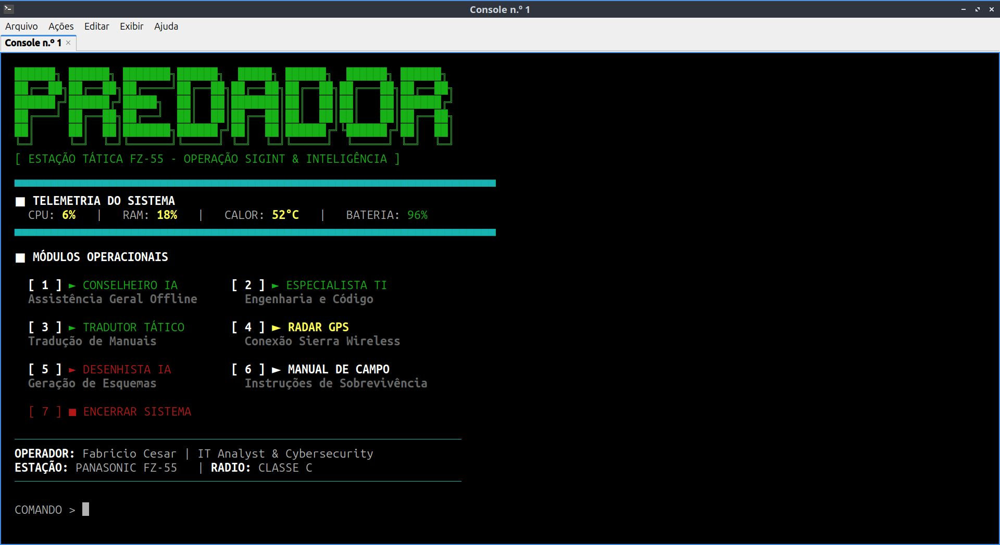

# 🦅 SISTEMA PREDADOR - Tactical Command Center



## 📋 1. VISÃO GERAL
O **Sistema Predador** é um painel de comando unificado via terminal para operações de Inteligência de Sinais (SIGINT), Radioamadorismo e assistência técnica em ambientes **100% Offline**. Desenvolvido para rodar em estações táticas (Panasonic Toughbook FZ-55) com DragonOS/Ubuntu.

---

## 🛠️ 2. INSTALAÇÃO DAS INTELIGÊNCIAS ARTIFICIAIS (OLLAMA)
O Predador não funciona sem os modelos de IA instalados. Siga estes passos exatamente nesta ordem:

**A) Instalar o motor Ollama:**
Abra o terminal e cole:
```bash
curl -fsSL [https://ollama.com/install.sh](https://ollama.com/install.sh) | sh

B) Baixar os modelos (Pull):
Aguarde o download de cada um (precisa de internet nesta etapa):

Bash
ollama pull llama3:latest
ollama pull dolphin-llama3:latest
ollama pull mannix/llama3.1-8b-abliterated:latest
🚀 3. INSTALAÇÃO DO SCRIPT E PERMISSÕES (CHMOD)
O Linux bloqueia a execução de scripts por segurança. Você DEVE liberar as permissões manualmente ou o sistema não abrirá.

A) Baixe o projeto:

Bash
git clone [https://github.com/turbonetlink/sistema-predador.git](https://github.com/turbonetlink/sistema-predador.git)
cd sistema-predador
B) Liberar execução (O segredo do funcionamento):
Execute estes comandos para transformar os arquivos em programas executáveis:

Bash
# Permissão para o "cérebro" do sistema
chmod +x predador.sh

# Permissão para o atalho visual
chmod +x Predador.desktop
🖥️ 4. CONFIGURANDO O ATALHO NA ÁREA DE TRABALHO
Para usar como um Analista de TI profissional e abrir pelo ícone:

Copie o arquivo Predador.desktop para sua pasta Desktop (ou Área de Trabalho).

PASSO VITAL: Clique com o botão direito no ícone que apareceu na sua área de trabalho e selecione "Allow Launching" (Permitir Execução).

O ícone mudará e agora você pode abrir o sistema com dois cliques.

📟 5. OPERAÇÃO E MÓDULOS
Para rodar direto pelo terminal: sudo ./predador.sh

[ 1 ] CONSELHEIRO IA: Assistente sem filtros para emergências e rádio.

[ 2 ] ESPECIALISTA TI: Suporte em engenharia e programação.

[ 3 ] TRADUTOR: Tradução técnica imediata (Inglês > PT).

[ 4 ] RADAR GPS: Sincroniza modem Sierra Wireless para mapas offline.

[ 5 ] DESENHISTA IA: Geração de esquemas via Stable Diffusion (Offline).

[ 6 ] MANUAL: Instruções rápidas de campo.

⚠️ 6. MONITORAMENTO DE HARDWARE (TELEMETRIA)
O sistema monitora seu Toughbook em tempo real:

INDICADOR VERMELHO EM CALOR: CPU passou de 80°C. Pare o processamento de IA para resfriar.

INDICADOR VERMELHO EM BATERIA: Menos de 20% de carga. Conecte à fonte de energia imediatamente.

❓ 7. PERGUNTAS FREQUENTES (FAQ)
"O script diz 'Permission Denied'!"

Você pulou o Passo 3B. Execute chmod +x predador.sh na pasta do arquivo.

"O GPS não encontra sinal!"

O GPS precisa de visada direta para o céu. Se estiver dentro de um prédio de concreto, o modem Sierra terá dificuldade em sincronizar.

"As IAs estão muito lentas!"

O processamento é 100% local no seu i7. Verifique se não há outros processos pesados rodando no htop.

👨‍💻 AUTOR
Desenvolvido por Fabricio Cesar
IT Analyst, Cybersecurity & Radioamador (Classe C)
Estação de Operação: Panasonic Toughbook FZ-55
